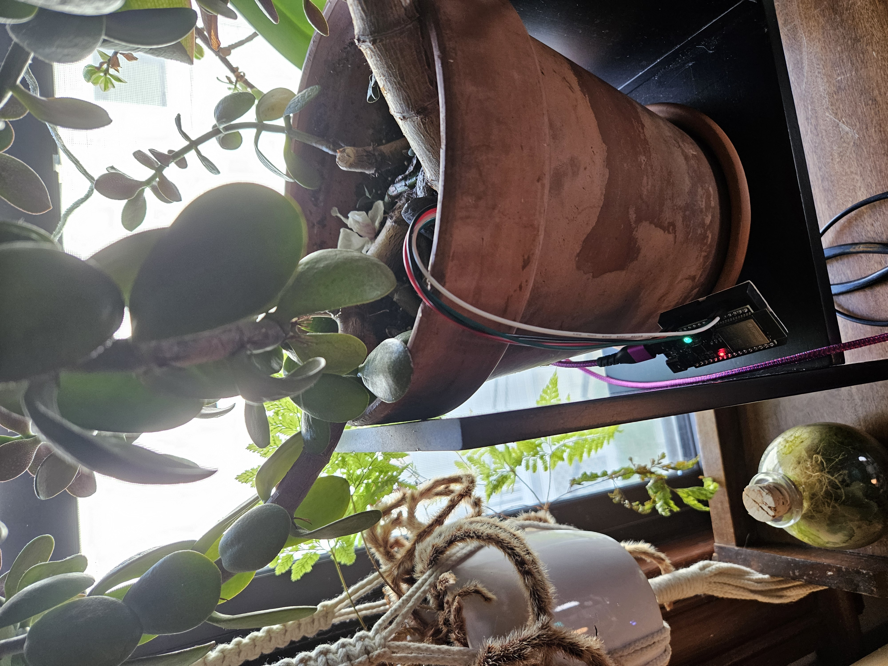

# Plant-Minder (WIP)

RPI4 + soil sensors to track when my plants need watering. 

## Contents
- [Description](#description)
- [Components / Design Details](#components--workspace-design-details)
  - [Esp32 / Sensors](#esp32sensor-layer)
  - [Broker layer](#broker-layer)
  - [TUI layer](#front-end--tui-layer) 
- [Status](#status)
- [Goals](#goals)
- [Limitations](#limitations)


## Description

This repo contains (mostly) all needed code for deployiong a simple plant monitoring system, which is a distributed system of microcontrollers programmed to control and report sensor data. Microcontrollers sense and report soil moisture data via a wireless mesh protocol, which is received by a raspberry pi. The pi has logic to determine soil conditions / trends and will ultimately alert me with a big obvious visual display whenever I need to water my plants.

```
         _            ________________________             _
        |            |                        |             |             
        |   pmindd > |      TUI Front End     |             |   < plant-minder
        |            |________________________|             |    (single binary)
        |                ^               |                  |   
    RPI |                | Events        | Subscribe        | 
        |             ___|_______________v____              |          __________
        |            |                        |             |         |  sqlite  |
        |   pmindb > |     Broker / Backend   |             |-------> | database |
        |            |_________(CoAP)_________|            _|         |__________|
        |                ^            |         
        |             ___|____________v_______             
        |            |      otbr-agent/       |             
        |            |       openthread       |             
        |_           |________________________|            
                       ^          ^          ^             
                       | 802.15.4 |          |      
                       |          |          |                
                     __|___    ___|___    ___|___ 
pmindp-esp32-thread>| ESP32|  | ESP32 |  | ESP32 | <-- CoAP
                     ------    -------    ------- 
                       ^          ^          ^
                       | i2c      |          |
                    ___v____   ___v____   ___v____    
                   | Sensor | | Sensor | | Sensor | 
                    --------   --------   --------  
```
 <--sensor alone
 <-- sensor in plant

### Components / Workspace Design details
The `pmindd` crate is where the front end/TUI rendering logic is defined (or, will be, when this is closer to being done). 

The `pmindb` crate is a lib where the the broker/monitor layer is defined / implemented.

The `otbr-agent` / `openthread` layer running on the pi is provided via a 3rd party binary; the pi must be set up to run the openthread stack via `otbr-agent`. More details / build steps available in [the parts list](./doc/part_list.md).

The `pmindp-esp32-thread` crate contains all of the code needed to program microcontrollers to control the soil sensor & to respond to CoAP registration requests from an observer (done by the broker layer in `pmindb`). 

### ESP32/Sensor Layer

Esp32 microcontrollers are used to control sensors and report data to the RPI via Thread, a wireless mesh protocol that runs on top of 802.15.4. Only 15.4 capable esp32 dev boards can be used; currently only esp32-c6 and esp32-h2 dev boards have an 802.15.4 native radio. 

The `pmindp-esp32-thread` crate contains all the code for building & flashing the esp32 dev boards with attached sensors (see photos below for example). This code is built on top of / uses libraries from `esp-hal`, and the Thread capability is provided directly via the `openthread` stack, which we can call into from Rust via the `esp-openthread` repo. The boards run bare metal (via `esp-hal`) and have code to control the soil sensor as a simple i2c device. 

As mentioned above, Thread provides the transport layer for reporting sensor data to the RPI. The code in the `pmindp-esp32-thread` crate programs the boards to program a hardcoded operational dataset to auto-attach to the Thread mesh network as a minimal thread device (MTD). It is worth noting that there is no support for NCP or RCP modes in the `esp-openthread` repo currently (these boards dont need it), so no need for dealing with any spinel shennanigans. 

The code currently supports various sensors including a capacitive soil sensor and a resistive sensor for soil moisture, as well as a light sensor.

### Broker Layer 

Defined in the `pmindb` crate, this is the layer that interfaces with the otbr-agent to provide the following responsibilities/functionality
- node monitoring & management
  - register new nodes as they come online (done automatically)
  - manage when nodes drop off the network
  - associate nodes that have had to reset themselves with their previous database entry (TBD)
- manage socket(s) where sensor data is received 
- push data into event queues and/or database (TBD what this piece will look like)
- expose event queues for the TUI front end to subscribe 
- provide requested info from the database 

It also interfaces with the front end layer to expose the data that gets rendered in (eventually) graphs and decisions around when it is time to water things. 

A main goal for this layer is to provide node management/monitoring, so that the system is fault tolerant and even if remote nodes fall off the network they will be picked back up and register to report sensor data as soon as they rejoin the network. This layer also is meant to handle received data and generate relevant event notifications etc. based on top-level subscriptions, so that I can ideally support different front end apps if I ever get to that point. 

Some additional [details on test layer / expected output here](./pmind-tests/README.md).

### Front end / TUI Layer

The main responsibility of this layer will be displaying sensor data as it is received from the mesh. It will do this very simply via TUI using `ratatui`, subscribing to event queues exposed by the broker layer. It is defined in the  `pmindd` crate.

An additional goal for this layer is to interface with the broker layer to query the database for rendering data trends and retrieving stored state like associations of plants with sensors, plant species, ideal soil moisture conditions, that sort of thing. I am striving for this to be as simple as possible-- all I need is to be provided with a visual cue that it is time to water my plants. 

Currently only simple data is rendered: soil moisture, temp, full spectrum light and lux, each as a graph rendered by node. 

 

More info on current status, build info, and [other details here](./pmindd/README.md).


## Status

In general I would estimate this is roughly at 75% complete. Lots of work is still needed. But basic sensor control / running openthread on the esp32 devices, and receiving reported sensor data on the pi is working. Some minimal rendering of the received data is also complete.

The work now largely revolves around the following:
- Adding additional sensor support
- Integrating an ORM and actually using a database
- Plant records / sensor association
- Sensor end devices behaving as more complex device types (see the section on [goals](#goals) and [limitations](#limitations))

## Goals

One major goal is more complex OT device type support for remote sensor controllers. The `esp-openthread` repo currently only supports running esp32 boards as MTDs. Work is ongoing to add support for running as both FTDs and as SED/SSEDs. Ideally these nodes will be able to run as FTDs when mains powered (so they can route packets for eachother) and SED (sleepy end device) waking up only to read and publish sensor data, for battery powered devices. 

Another goal is to eventually support other moisture sensors
- [Sunfounder capacitive moister sensor](https://www.digikey.com/en/products/detail/sunfounder/ST0160/22116813) 
- [SparkFun soil moisture sensor](https://www.digikey.com/en/products/detail/sparkfun-electronics/SEN-13322/5764506)
- [Adafruit light sensor](https://www.adafruit.com/product/1980)
- Others TBD (Co2)


## Limitations
In general there are many; this is just a hobby project being done in my spare time. But arguably the biggest limitations of the current system is that the sensors currently only support acting as child devices on the thread network (MTDs) and are very simple in their implementation. The TL;DR of these limitations means that range is limited and the system will not really have the benefits of a full mesh (it will have a star, or hub and spoke topology). Therefore the child nodes cant be too far away from the RPI or they will drop off the network. The current impl also requires that no other router nodes be on the network that may be at any point "better parents" than the RPI (e.g. have better link quality w.r.t. any given child node). 

#### More supplemental info re: above informations (skippable)
There are a few reasons for this: the OT client implementation currently monitors the thread network by periodically pulling the child ip addresses (through the `childip` cli cmd) and checking the returned values to presence of new or absence of nodes. If the child nodes have better link quality with another router, they will perform mesh link establishment/basically reparent themselves to that router. That means that the RPI wont have access to the IP addresses of those child nodes via the `childip` cli command. Obtaining addresses that parents will route packets to child nodes for, without the child node performing some additional steps (service registration), then becomes an issue. This can be solved by adding code where the child nodes register services (a "soil sensor" service for example) with an SRP service registrar, which the RPI is providing as a border router. Then the RPI (or any device on the network really) can perform a service lookup to find such services, and to obtain a routable IP address that will allow parents to route packets using that address successfully to child nodes. That will add a lot more complexity so that will be added as a future enhancement. 