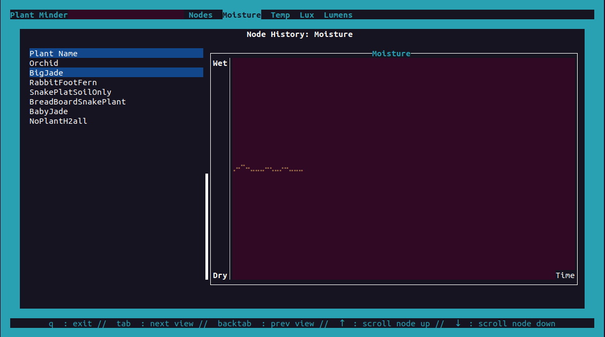

# Plant-Minder (WIP)

RPi + soil sensors to track when my plants need watering. 

## Contents
- [Description](#description)
- [Components / Design Details](#components--workspace-design-details)
  - [Esp32 / Sensors](#pmindp-esp32-thread-esp32sensors)
  - [Broker](#pmind-broker-broker)
  - [Broker Clients (TUI and Database)](#pmindd-and-pmindb-broker-client-subscribers) 
- [Status](#status)

## Description

This repo contains (mostly) all needed code for deployiong a simple plant monitoring system. It is a distributed system of microcontrollers that sense and report soil moisture data via a wireless mesh protocol, which is received by a raspberry pi. The RPi has logic to determine soil conditions / trends and will ultimately alert me with a big obvious visual display whenever I need to water my plants.

```
         _     __________________________________________________      _
        |     |                     pmindd                       |      |
        |     |                  TUI Front End                   |      |  < plant-minder
        |     |__________________________________________________|      |   single binary 
        |         ^  Events /     |  Subscribe             ^ History    |   dxatabse 
        |         |  data         |                        | (optional) |   integration is
RPi Host|      ___|_______________v____   Subscribe    ____v_____       |   optional
config'd|     |      pmind-broker      | <----------  |  pmindb  |      |
for RCP |     |     Broker / Backend   | Events/data  |  sqlite  |      |
 mode w |     |________________________| ---------->  | database |      |
15.4 SoC|         ^           ^                       |__________|     _|
 dongle |         |           | ot-cli 
        |         |   ________v__________________________________                               
        |         |  |          otbr-agent/ openthread           |  
        |         |  |___________________________________________|
        |         |    |                              ^
        |      ___v____v______________________________|__________           
        |     |  linux kernel (15.4 drivers, IPv6 stack etc.)    |             
        |_    |__________________________________________________|            
                ^                   ^                   ^             
                | 802.15.4          |                   |       
                |                   |                   |                     
              __|_____          ____|___              __|_____      _
             | ESP32  |        | ESP32  |            | ESP32  |      | < pmindp-esp32-thread
             | sensor |        | Sensor |            | sensor |      |  each node supports
             |________|        |________|            |________|     _|   multiple sensors
                                                         
```

 <--protoboard with tsl2591
 <-- breadboard


## Components / Workspace Design details

### `pmindp-esp32-thread`: ESP32/Sensors

The `pmindp-esp32-thread` crate contains all of the code needed to program esp32c6 or esp32h2 dev boards to control/read from attached sensors, to respond to CoAP registration requests (done by the broker layer), and to continuously report sensor data once registered. Data is reported directly to the RPi host controller via Thread, a wireless mesh protocol that runs on top of 802.15.4. 

The `pmindp-esp32-thread` crate contains all the code needed for building & flashing the esp32 dev boards with attached sensors. TThe boards run bare metal (via `esp-hal`), with a minimal `openthread` stack, with Rust bindings provided via the `esp-openthread` repo. The code currently can control up to 5 i2c sensors of various types relevant to monitoring plant health. Only 15.4 capable esp32 dev boards can be used; currently only esp32-c6 and esp32-h2 dev boards have an 802.15.4 native radio. More details on steps for building/running, currently supported sensors, and design details [provided here](./pmindp-esp32-thread/README.md).


### `pmind-broker`: Broker

A major component of the system is the broker, which is defined in the `pmind-broker` crate. This crate defines a public API for clients to subscribe to sensor node data. The broker logic interfaces with the Thread mesh (via the `otbr-agent`/ `openthread` stack) to provide the following:
- node state monitoring & management
  - register new nodes as they come online (done automatically)
  - manage when nodes drop off the network (socket clean up, notify subscribing clients)
- node data management and routing, enqueuing data to event queues that external clients can poll / receive data on

### `pmindd` and `pmindb`: Broker Client Subscribers 

This piece is still evolving but some functionality is currently in place. Currently able to render a nice display (via TUI provided by `pmindd`, see picture below) and there exists some simple database functionality. 

#### Tui front end 

The `pmindd` crate is where the front end/TUI rendering logic is defined. It is intended to be a client that subsribes to events as exposed via the broker layer. 

 

The main responsibility of the TUI layer is to display sensor data as it is received from the mesh. It receives data by subscribing to event queues exposed by the broker layer. "Graphic" rendering is achieved using the `ratatui`crate (its not really graphical but lets pretend). Currently only simple data is rendered: soil moisture, temp, full spectrum light and lux, each as a graph rendered by node. More info on current status, build info, and [other details here](./pmindd/README.md).

#### Database

The `pmindb` crate defines a sqlite database handle that can be optionally configured as a subscribing client to the broker. This piece is still a work in progress-- it needs a better API but hopefully will ultimately allow supporting different front ends eventually. Currently supports `sqlite3` database via `diesel` 

### `OpenThread` and `otbr-agent`

The `otbr-agent` / `openthread` layer running on the pi is provided via a 3rd party binary; the pi must be set up to run the `openthread` stack via `otbr-agent`. More details / build steps available in [the parts list](./doc/part_list.md). The best resource for build details and general Thread info is [the openthread site](https://openthread.io/), and the [openthread github org](https://github.com/openthread/), which hosts  the opensource implementation of the Thread protocol. 

## Status

In general I would estimate this is roughly at 75% complete. Lots of work is still needed. But basic sensor control / running openthread on the esp32 devices, and receiving reported sensor data on the pi is working. Some minimal rendering of the received data is also complete, as well as simple database integration.