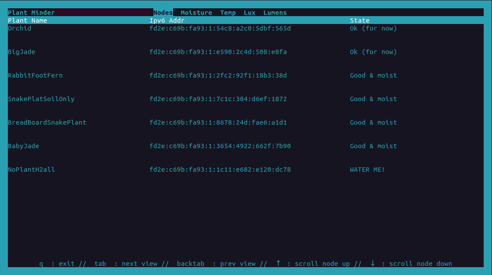
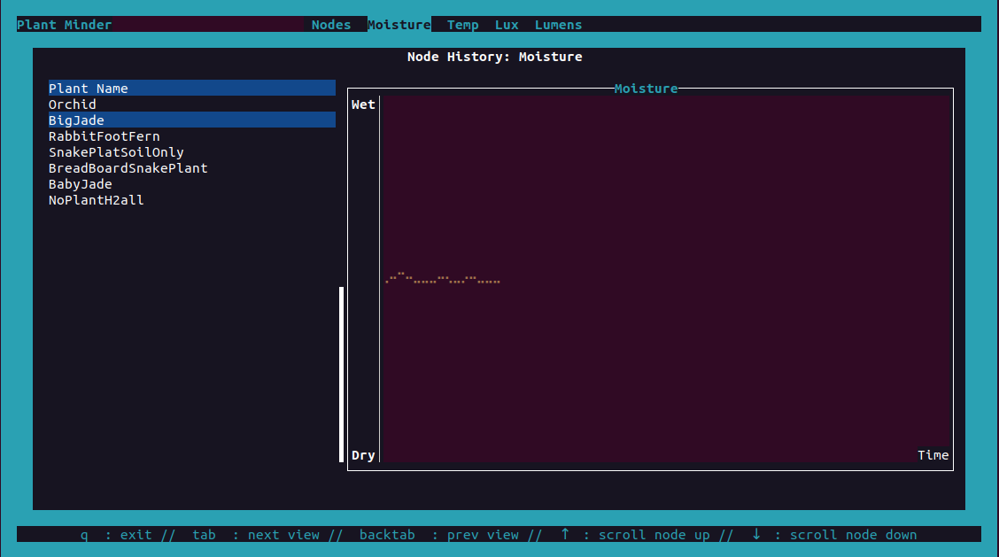

# `pmindd`

TUI Front end is a work in progress!  

# Build 

For building for an RPI 5 running raspbian kernel release `6.1.0-rpi7-rpi-2712` / kernel version `#1 SMP PREEMPT Debian 1:6.1.63-1+rpt1 (2023-11-24)`, I am using rust target `aarch64-unknown-linux-gnu`, and have separately installed the `aarch64-linux-gnu-gcc` toolchain (version 11.4.0), building on Ubuntu. 

To build the current `plant-minder` example bin, use the following:
```
cargo build --target=aarch64-unknown-linux-gnu --bin plant-minder --release
```

For older versions of the rpi you may need to use a different target (like `armv7-unknown-linux-gnueabihf`) and the appropriate gcc toolchain. Make sure that your gcc toolchain is at the same path specified in this crate's `.cargo/config.toml` file, or modify the config file according to your needs. 

# Current working state
 
Currently only very simple functionality is implemented. There is a simple asynchronous rendering of live sensor readings. There is a landing page that displays the general state of each plant (E.g. if it needs to be watered or not). With keyboard input, a user can use tab/backtab to scroll through historical views of data displaying moisture, temperature, lux, or full spetrum luminsoity readings. These readings are rendered as graphs are displayed by node, and you can scroll through each node's view (by scrolling up or down). The below shows example output from the pi (via ssh session) that currently has a number of child nodes reporting their plant name, moisture, temp, full spectrum light (as lumens) and lux. This shows the landing page:



This shows a rendering of moisture over time: 

 


# Logging

Logs will be output to a logs dir, with daily rolling, and max level set to debug. To modify this, see `pmindd/src/bin/main.rs`

## Needs (in no particular order)
- historical trend graph rendering
- Better configurable logging, more command-line-specifyable args!
- Log zip/roll functionality so we dont take up too much space with old logs
- Loads of other stuff 
