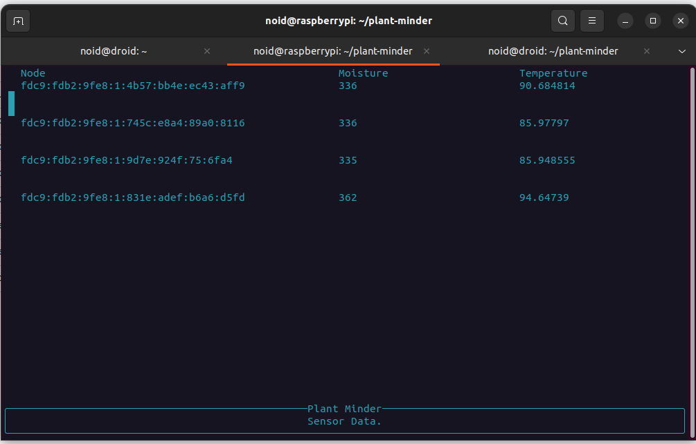

# `pmindd`

TUI Front end is a work in progress!  

# Build 

For building for an RPI 4 running raspbian kernel release `6.1.0-rpi7-rpi-2712` / kernel version `#1 SMP PREEMPT Debian 1:6.1.63-1+rpt1 (2023-11-24)`, I am using rust target `aarch64-unknown-linux-gnu`, and have separately installed the `aarch64-linux-gnu-gcc` toolchain (version 11.4.0), building on Ubuntu. 

To build the current `plant-minder` example bin, use the following:
```
cargo build --target=aarch64-unknown-linux-gnu --bin plant-minder --release
```

For older versions like 3b+ use the `armv7-unknown-linux-gnueabihf` target and the appropriate toolchain. Make sure that your gcc toolchain is at the same path specified in this crate's `.cargo/config.toml` file

# Current working state
 
Currently only very simple functionality is implemented. There is a simple asynchronous rendering of live sensor readings. These readings are rendered & outpit to the terminal 
in a simple table. The below shows example output from the pi (via ssh session) that currently has 4 child nodes reporting moisture and temp (it is very hot here)


## Needs (in no particular order)
- Database integration (for showing historical trend graph)
- Database management? Probably need an ORM
- Graph rendering (historical trends)
- Plant record creation, to allow associating a sensor with a plant record (will probably be parsed from a toml file at first with a file watch to update it dynamically)
- Optionally piping logs to file (and log management)
- Loads of other stuff 
