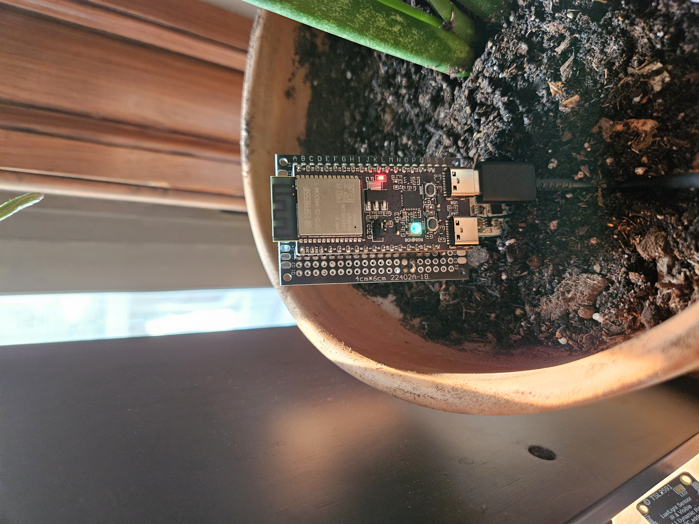

# `pmindp-esp32-thread` 

Code in this dir is used to program esp32 dev boards to act as remote sensor nodes, reporting sensed soil data (and other sensed data, depending on attached sensors) to an RPI via the Thread protocol / CoAP. 

Supports the `esp32c6` and `esp32h2` model dev boards, as well as a number of sensor types. Features are used to conditionally compile for either the `esp32c6` or `esp32h2` dev boards. Additionally, features control compilation/inclusion of sensor initialization and reporting. See below for list of supported sensors and their associated feature flags.

# Contents
- [Build Steps](#build)
  - [Assigning a Plant Database ID via cfg.toml](#plant-database-recors-and-cfg.toml)
  - [Example Log Output](#working-example-log-output)
- [Status](#status)
  - [What Works](#what-works)
  - [What Does Not Work](#what-does-not-work)
  - [Sensor Support](#sensor-support)
      - [Soil Sensors](#soil-sensors) 
      - [Light Sensors](#light-sensors) 
      - [Gas/Humidity Sensors](#gas/humidity-ensors) 
- [Design Details](#design-details)
   - [Generic Sensor Types](#generic-sensor-types)
   - [Error Handling and Recovery](#error-handling-and-recovery)


# Build

Requires nightly, `espflash` toolchain and `riscv32imac-unknown-none-elf` target

For example, to build for an esp32c6 dev board with an atsamd10 sensor attached, use the following: 
```
cargo +nightly espflash flash --monitor --bin main --features="esp32c6","atsamd10" --target=riscv32imac-unknown-none-elf --release --port <PORT> 
```

Make sure to erase flash first (and before deploying newly compiled code):
```
cargo espflash erase-flash --port <PORT>
```

If you only have one dev board attached to your dev machine then you can omit the `port` arg.

## Plant Database Records and `cfg.toml`

Each sensor can be built to associate it with a specific plant you are monitoring. This is useful for database purposes; you can associate a known plant type with the stream of sensor data. 

As you build and flash the code onto a sensor, note which plant you want to put it in and give it a unique name in the name field of `cfg.toml` file. This is used by the RPI to associate sensor data with a plant record. More build configuration options will likely be added to this file in the future.

## Working example log output

In the following log output, the device has an `atsam10`, `tsl2591`, and `bme860` sensor attached. It has an associated plant record name of "Orchid". When things are working you will see serial output like this: 
```
...
INFO - otPlatRadioSetShortAddress 0x4080c270 55439
0x4080c270 - ot::gInstanceRaw
    at ??:??
WARN - timer interrupt triggered at 4034
INFO - trigger_tx_done
INFO - EventAckRxDone
WARN - timer interrupt triggered at 23922
INFO - Received CoAP request '1289 Get soilmoisture' from fd2e:c69b:fa93:1:134c:7a9f:bbe7:e5b5
INFO - Currently assigned addresses
INFO - fd2e:c69b:fa93:1:a2ee:6ebc:c675:9cc6
INFO - fdde:ad00:beef::ff:fe00:d88f
INFO - fdde:ad00:beef:0:f436:cf62:7907:c78
INFO - fe80::e0d4:9263:87d:bd77
INFO - Role: Child, Eui [
    0xF0,
    0xF5,
    0xBD,
    0x1,
    0x65,
    0xF4,
] Plant Name "Orchid" Port 1289
INFO - Handshake complete
INFO - Sending SensorReading { soil: Soil { moisture: 322, temp: 86.89116 }, light: Some(Light { fs: 46863, lux: 1133.0674 }), gas: Some(Gas { temp: 88.772, p: 679.21, h: 54.009, gas: 162754 }), ts: 0 }
WARN - timer interrupt triggered at 45628
WARN - timer interrupt triggered at 45633
INFO - trigger_tx_done
INFO - EventAckRxDone
WARN - timer interrupt triggered at 45644
WARN - timer interrupt triggered at 45649
INFO - trigger_tx_done
WARN - timer interrupt triggered at 45657
WARN - timer interrupt triggered at 45662
INFO - trigger_tx_done
INFO - EventAckRxDone
INFO - Sending SensorReading { soil: Soil { moisture: 322, temp: 86.52355 }, light: Some(Light { fs: 46952, lux: 1135.2434 }), gas: Some(Gas { temp: 88.772, p: 679.21, h: 54.003, gas: 169140 }), ts: 0 }
...
```

And you should also see on the RPI the received data.

Folks interested can set it up with a few different constructions/prototypes using protoboard (requires soldering obviously) for example:
 

Weatherizing/making the probe portions waterproof with conformal coating and heat shrink is next up on my to-do list. 

# Status

The following is a high-level description of what currently works followed by a by-no-means comprehensive list of what does not work (but which I hope to soon address). I also cover what sensors the code currently supports and the feature flags used to build for them. 

## What works:
- Devices attach to an established Thread network (with hardcoded creds) and act as MTD (child) devices on the network
- Sensor control (reading data) with a number of sensors currently supported (See next section) 
- Minimal CoAP logic exists
    - Oberver registration
    - Sensor publishing at configurable intervals
- Feature-flag enabled sensor configuration
- Compile-time configuration of reported plant record  
- Some minimal logic for `tsl2591` light sensors to dynamically adjust based on current light conditions (This works but the logic could be optimised to be more performant e.g. to find the optimal config faster)
- Compile-time configuration of plant record identifier

## What does not work:
- FTD/Router node support (limitation of `esp-openthread` but Im workin on it!)
- Robust CoAP support 
- Thread commissioning/joiner support  (limitation of `esp-openthread` but Im workin on it!)
- NVM storage
- better error handling; theres lots of places with unwraps that could panic 
    - w.r.t. error handling / panic, need some kind of watchdog to trigger board reset if there is a panic, right now panics will halt all operation
- Plenty more 

## Sensor Support

A number of sensor types are currently supported: soil, light, and gas/humidity. Code is configured to support up to 5 sensors per esp32: one soil sensor (required), 2 light sensors, a gas/humidity sensor, and misc/other (basically TBD what this type will be).

Code must be compiled with at least a soil sensor type set up; only one type and one sensor is currently allowed (any attempt to build with more will generate a compile time error).  

Note that any i2c device attached must have a unique address although future enhancements may involve allowing configuration for i2c mux device to allow up to 8 i2c devices with the same address.

The following sensor types and models are supported, listed with the feature flag to use to enable them. Product links can be found in [the parts list](./doc/part_list.md) 

### Soil Sensors

| Sensor/Product Name         | Feature flag  |
|-----------------------------|---------------|
| Seesaw soil sensor atsamd10 | `atsamd10`    |
| Sparkfun resistive probe    |`probe_circuit`|

### Light Sensors

| Sensor/Product Name         | Feature flag  |
|-----------------------------|---------------|
| Adafruit lux/light sensor   | `tsl2591`     |

### Gas/Humidity Sensors

| Sensor/Product Name         | Feature flag  |
|-----------------------------|---------------|
| Adafruit/bosch Gas/humidity |`bme680`       |

### Planned Support
- sht40 humidity & temp
- veml7700 lux sensor
- sunfounder soil sensor st0160
- NPK sensors (will need to do some legwork to determine if I can support modbus on this device, that is still TBD)
- Plenty of others; maybe a VC02 sensor or pH 

# Design Details

At a high level the code can be describes as a simple event loop where, after a series of configuration steps, the node will join the Thread network and enter the main event loop. It will then service any tasklets/pending processes that arise due to normal openthread operation, waiting until it receives a CoAP observer registration from the RPI. Once that registration is received, the node will start reporting sensed data at a fixed interval, depending on which sensors are currently configured/attached to the board. If the node experiences some unrecoverable sensor error or otherwise drops of the Thread network, it will exit the event loop, which causes the node to reset itself. It will report the same EUI and other plat record-relevant data back to the RPI on reset, so it's old data entries can be associated with the newly registered address it configures itself with (which is unique on each reset). Below is a description of the general structure for supported sensor types as well as a section describing error handling in more detail. 

## Generic Sensor Types

The `pmindp-esp32-thread` crate depends on the `pmindp-sensor` crate, which defines a number of sensor traits and structs. The design of the code using these traits and structs, and how they are implemented in the `pmindp-esp32-thread` crate, is intended to allow for various compositions of sensor types and allow for vendor-specific methods of reading sensed data. The supported sensors implemented in this crate can be conditionally compiled using feature flags.

The sensor traits allow for generic `read` methods to be applied at the paltform level, regardless of the type of sensor. For each supported sensor, there is a trait implementation of `pmindp_sensor::Sensor` which defines the `read` operation, and the platform (Esp32) code has logic to call `read` on each attached sensor per the `pmindp_sensor::SensorPlatform` trait. 

The `pmindp-sensor` crate also defines the data structs that the nodes use to report sensed data to the RPI. Each sensor type has an associated struct that gets populated and written into a buffer (for sending). There is a struct for soil measurements, light measurements, and gas/humidity measurements. 
Right now the structs all force a single type for each metric to be reported (e.g. `u16` for soil moisture, `f32` for lux, etc.). Future optimizations will make this more configurable. 

This construction allows the platform layer code to iterate through a vector of sensors (that may or may not be currently initialized), and for each existing sensor obtain sensed data. That data is then packaged up, serialized and sent to the RPI via the Thread mesh. 

## Error Handling and Recovery
Right now, if the node experiences an unrecoverable error it will trigger a reset which will knock the node offline temporarily, but it will come back online and rejoin. When it comes up it will join the thread network as a fully new node. The broker logic running on the RPI will pick it up as a new node & will re-register to receive sensor data without any human intervention. 

Future optimizations will involve better recovery and logic to enable nodes to store data in NVS so they can perhaps store certain info like the dataset / can come back online after a power event and register with the same addresses etc

There are also many places in both this code and in the branch of `esp-openthread` I am using where there are unwraps which need to be improved so that we dont panic anywhere. If there is a panic the reset logic will not trigger and the node will remain offline. So this needs some attention
